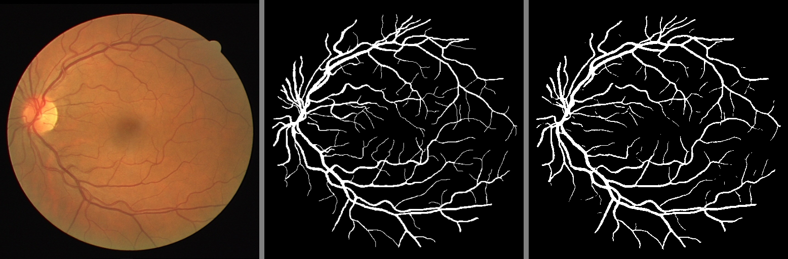
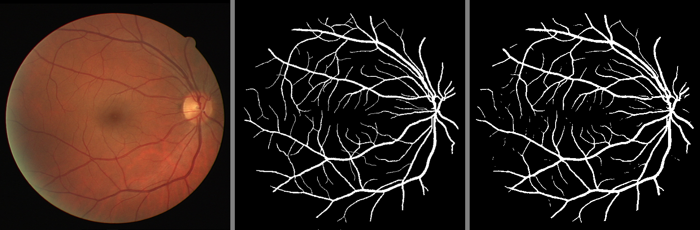
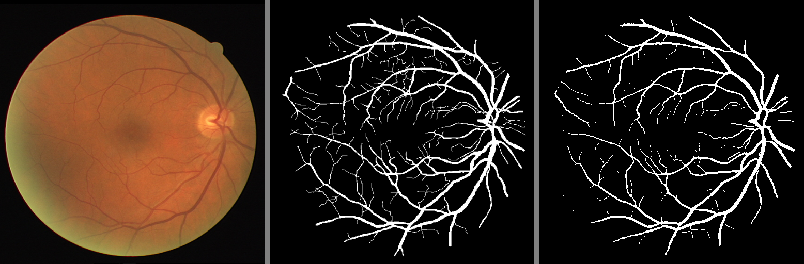

# Attention U-Net for Retinal Blood Vessel Segmentation

This repository provides an implementation of **Attention U-Net** for retinal blood vessel segmentation, using the DRIVE dataset. The Attention U-Net integrates **attention gates (AGs)** into the U-Net architecture, enhancing feature learning and localization by focusing on relevant image regions. This is particularly useful for segmenting small or complex structures like blood vessels, improving accuracy in medical image segmentation tasks.

---

## Dataset Overview

The **DRIVE database** supports comparative studies on retinal blood vessel segmentation. It provides critical data for diagnosing and analyzing cardiovascular and ophthalmologic diseases such as diabetes, hypertension, and arteriosclerosis. Automatic segmentation of retinal vasculature can assist in:
- Screening programs for diabetic retinopathy.
- Research on vessel tortuosity and hypertensive retinopathy.
- Vessel diameter analysis for hypertension diagnosis.
- Computer-assisted laser surgery and retinal image registration.
- Biometric identification using the unique retinal vascular tree.

Dataset details: [DRIVE Database](https://drive.grand-challenge.org/)

---

## Data Preparation and Augmentation

This script processes and augments medical image datasets for semantic segmentation. 

### Pipeline Overview:
1. **Dataset Structure**:
    ```
    data/
    ├── training/
    │   ├── images/         # Input images (.tif)
    │   ├── 1st_manual/     # Corresponding masks (.gif)
    ├── test/
    │   ├── images/
    │   ├── 1st_manual/
    ```

2. **Data Augmentation** (using Albumentations library):
    - **Horizontal Flip**
    - **Vertical Flip**
    - **Rotation** (up to 45°)
    - Resizing to **512x512**
    - Augmented images and masks are saved in:
      ```
      new_data/
      ├── train/
      │   ├── image/
      │   ├── mask/
      ├── test/
      │   ├── image/
      │   ├── mask/
      ```

3. **Customization**: 
   - Toggle augmentation (`augment=True/False`) or add more transformations.

This pipeline introduces dataset diversity while preserving label integrity, ensuring robust training for semantic segmentation tasks.

---

## Installation and Usage

### Install Dependencies:
Run the following command to install required Python packages:
```bash
pip install torch scikit-learn matplotlib pandas numpy
```

### Run the Model:
1. Execute the provided `.sh` script:
    ```bash
    bash run_pipeline.sh
    ```
2. Or directly run the `main.py` file to start the training and evaluation process:
    ```bash
    python main.py
    ```

---

## Results

The images below contain:
1. **Input Image**  
2. **Ground Truth**  
3. **Predicted Mask**

|  |
| :-----------------------: |
|  |
|  |

---

This repository provides a robust starting point for retinal blood vessel segmentation using Attention U-Net. Contributions and feedback are welcome!

